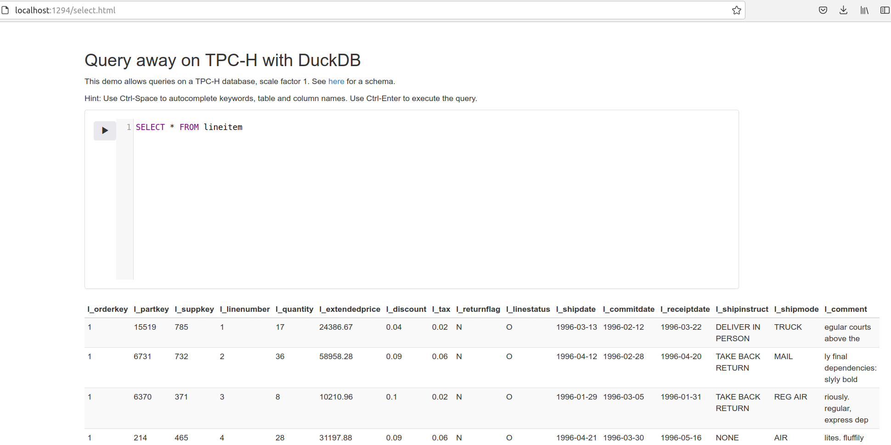
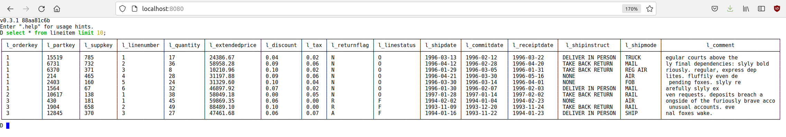

# duckdbrest

Example with containerized duckdb

	- duckdb_rest_server
	- gotty web interface for duckdb CLI

## usage

Build and start using Makefile

See docker-compose.yml

Once running, open

	- http://localhost:1294 (duckdb_rest_server)
	- http://localhost:8080 (duckdb CLI from web tty)

## screenshots

