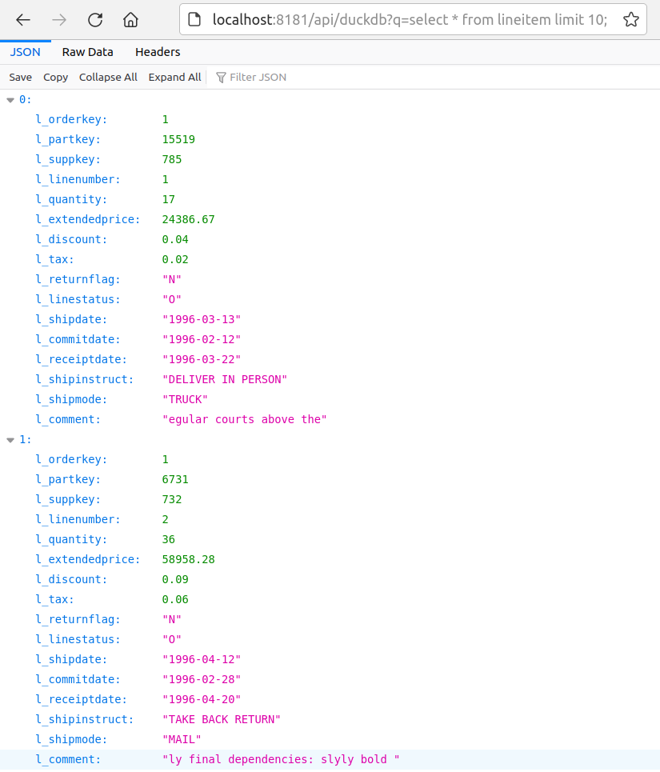

# duckdbrest

Example with containerized duckdb (see docker-compose.yml):

- duckdb_rest_server - which powers the demo at https://duckdb.org
- gotty web interface for duckdb CLI against TCP-H 0.1 data
- bash-cli-api - a toy example based on a slightly modified variant of https://github.com/yurikoex/bash-rest-server, uses bash along with socat, jq and grep to query the data

## usage

Build and start using Makefile (see docker-compose.yml).

Once running, open

	- http://localhost:1294 (duckdb_rest_server)
	- http://localhost:8080 (duckdb CLI exposed as web tty)

Or if brave try the toy example bash api server:

	curl -s http://localhost:8181/api/duckdb?q=select%20*%20from%20lineitem%20limit%202;

	# or without urlencoding the sql query and using firefox
	firefox "http://localhost:8181/api/duckdb?q=select * from lineitem limit 10;"

## screenshots

The duckdb_rest_server with TCP-H 0.1 in a container:

The "gotty" web interface to duckdb in this container:

The bash-api-cli toy example in the same container:

